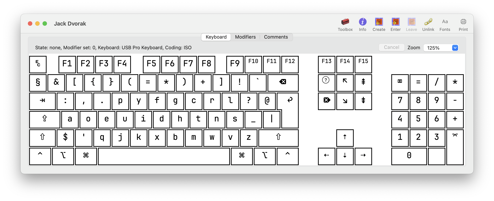
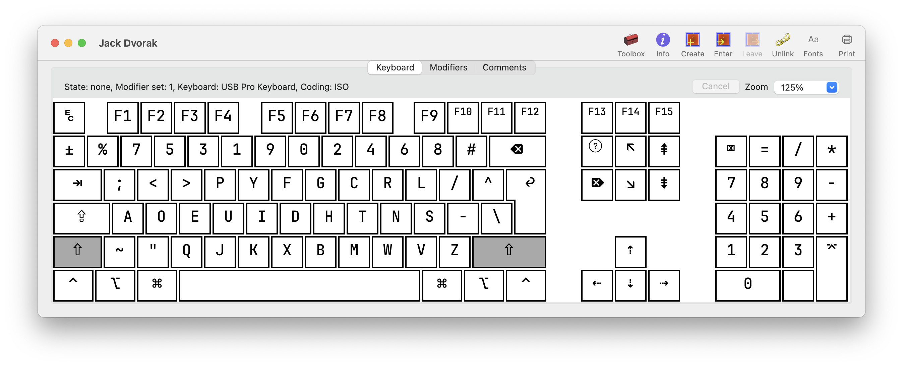

# jack-dvorak

A programmer dvorak variant I use.

This is a mixed layout of [Programmer Dvorak] and [macOS's Dvorak - QWERTY ⌘](https://en.wikipedia.org/wiki/Dvorak_keyboard_layout#Mac_OS:~:text=Apple%20also%20includes%20a%20Dvorak%20variant%20they%20call%20%22Dvorak%C2%A0%E2%80%93%20Qwerty%20%E2%8C%98%22.%20With%20this%20layout%2C%20the%20keyboard%20temporarily%20becomes%20QWERTY%20when%20the%20Command%20(%E2%8C%98/Apple)%20key%20is%20held%20down.) layout.

I also swapped some symbols to fit TypeScript (`;:`, `-_`, `/?`, `\|`, <code>`#</code>).

## Screenshot

## Source code

[Windows version](./jack-dvorak.klc), using [Microsoft Keyboard Layout Creator](https://www.microsoft.com/en-us/download/details.aspx?id=102134)

[macOS version](<./Jack Dvorak.keylayout>), using [Ukulele](https://software.sil.org/ukelele/)

## Credits

[Programmer Dvorak][Programmer Dvorak]

[jayliu50/windows-programmer-dvorak](https://github.com/jayliu50/windows-programmer-dvorak)

[Programmer Dvorak]: http://www.kaufmann.no/roland/dvorak/
